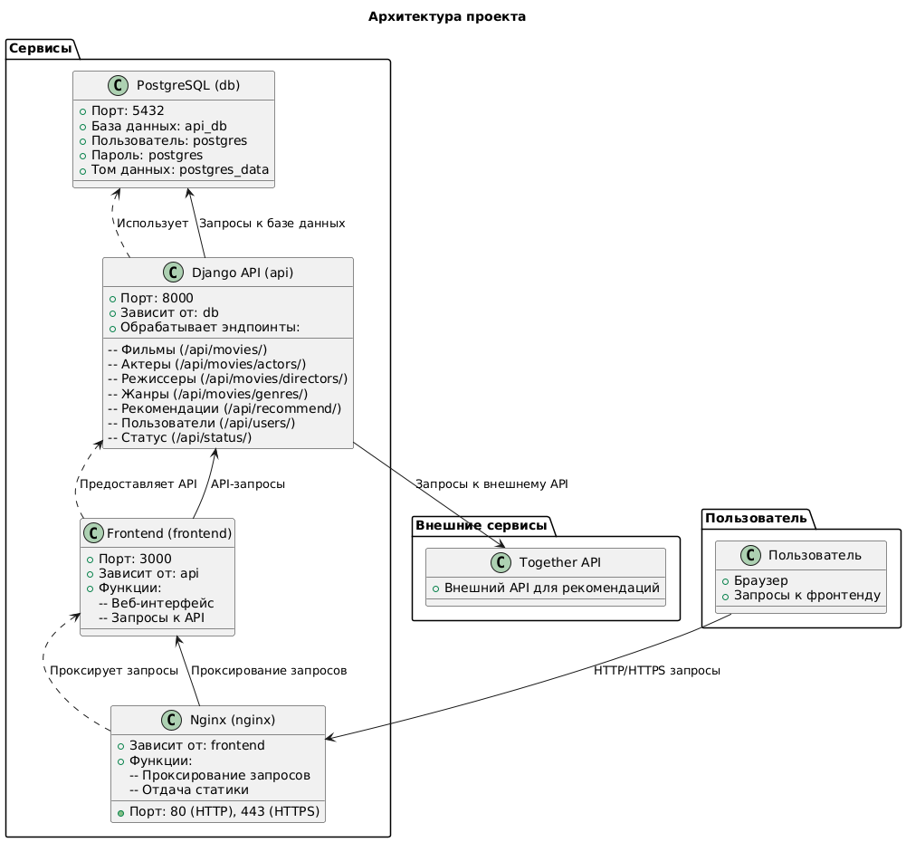

# Документация проекта FilmsHub

Добро пожаловать в документацию FilmsHub! Этот проект представляет собой веб-приложение для управления фильмами, актерами, режиссерами и пользователями. Оно включает в себя REST API, фронтенд, базу данных и прокси-сервер для обработки запросов. Ниже приведено описание архитектуры, API, CI/CD и инструкции по запуску проекта.

---
Проект разрабатывался в рамках соревнования по продуктовой разработке - PROD <br>
Команда: <br>
Arlandaren - аналитик/бекенд <br>
Slezkins - бекенд/девопс <br>
Sansly - бекенд <br>
Quaddis - фронтенд <br>
Anrean Augusta - фронтенд/дизайн <br>

---

## Сайт
[тык](https://prod-team-42-p2j2ueen.final.prodcontest.ru/)

## Оглавление

- [Документация проекта FilmsHub](#документация-проекта-filmshub)
  - [Оглавление](#оглавление)
  - [Архитектура проекта](#архитектура-проекта)
    - [Схема взаимодействий](#схема-взаимодействий)
  - [API документация](#api-документация)
  - [Запуск проекта](#запуск-проекта)
  - [Структура проекта](#структура-проекта)
  - [База данных](#база-данных)
  - [CI/CD](#cicd)
    - [Этапы CI/CD:](#этапы-cicd)
    - [Конфигурация CI/CD:](#конфигурация-cicd)
  - [Примеры запросов](#примеры-запросов)
    - [Получить список фильмов](#получить-список-фильмов)
    - [Добавить фильм](#добавить-фильм)
    - [Вход в систему](#вход-в-систему)
  - [Swagger документация](#swagger-документация)

---

## Архитектура проекта

Проект состоит из нескольких сервисов, которые взаимодействуют между собой:

1. **PostgreSQL (db)**:
   - База данных для хранения информации о фильмах, актерах, режиссерах, пользователях и т.д.
   - Порт: `5432`.

2. **Django API (api)**:
   - Основной сервис, предоставляющий REST API для взаимодействия с данными.
   - Порт: `8000`.
   - Зависит от PostgreSQL.

3. **Frontend (frontend)**:
   - Веб-интерфейс для взаимодействия с пользователем.
   - Порт: `3000`.
   - Зависит от Django API.

4. **Nginx (nginx)**:
   - Прокси-сервер для обработки входящих запросов и отдачи статики.
   - Порт: `80` (HTTP) и `443` (HTTPS).
   - Зависит от Frontend.

### Схема взаимодействий



---

## API документация

Полное описание всех эндпоинтов API можно найти в файле [api.md](docs/ru/api/api.md). Основные разделы API:

- **Фильмы**: Управление фильмами (поиск, добавление, удаление).
- **Актеры**: Получение информации об актерах.
- **Режиссеры**: Получение информации о режиссерах.
- **Жанры**: Получение списка жанров.
- **Рекомендации**: Получение рекомендаций по фильмам.
- **Пользователи**: Управление пользователями (регистрация, вход, выход).
- **Статус**: Проверка статуса системы.

---

## Запуск проекта

Для запуска проекта необходимо выполнить следующие шаги:

1. Убедитесь, что у вас установлены Docker и Docker Compose.
2. Склонируйте репозиторий:
   ```bash
   git clone https://gitlab.prodcontest.ru/team-42/project.git
   cd project
   ```
3. Создайте файл `.env` в корне проекта и заполните его необходимыми переменными окружения (пример в `.env.example`).
4. Запустите проект с помощью Docker Compose:
   ```bash
   docker-compose --env-file=.env up --build
   ```
5. После запуска:
   - API будет доступно на `http://localhost:8000`.
   - Frontend будет доступен на `http://localhost:3000`.
   - Nginx будет доступен на `http://localhost`.

---

## Структура проекта

```
.
├── backend/               # Django API
│   ├── Dockerfile
│   ├── requirements.txt
│   └── src/              # Исходный код Django
├── frontend/             # Frontend
│   ├── Dockerfile
│   └── src/              # Исходный код фронтенда
├── nginx/                # Nginx конфигурация
│   └── nginx.conf
├── docker-compose.yml    # Docker Compose конфигурация
├── .env.example          # Пример переменных окружения
├── api/                  # API документация
│   └── api.md
└── imgs/                 # Изображения (схемы, диаграммы)
    └── schema.png
```

---

## База данных

В проекте используется производительная база данных - PostgreSQL, обеспечивающая быстрый и удобный доступ к данным.


Основные таблицы:
   - films_film: Таблица фильма, содержит ключевые поля для него, а также актеров, факты и режиссера через связи
   - films_fact: Интересные факт о фильме
   - users_bookmarks: Закладки пользователя, такие как лайки, дизлайки, закладка для просмотренных фильмов и тех которые хотелось бы пересмотреть
   - films_director: Режиссер фильма
   - films_actor: Актер
   - users_user: Пользователь
   - recommendations_airechistory: История взаимодействия пользователя с AI

Некоторые таблицы напрямую не используются в коде, они создаются Django автоматически и используется им, это такие таблицы как: `users_user_group`, `django_content_type`, `auth_group`, `auth_permission`, `auth_group_permission`, `django_migrations`.

---

## CI/CD

Проект использует CI/CD для автоматизации процессов тестирования и развертывания. Конфигурация CI/CD описана в файле `.gitlab-ci.yml` и включает следующие этапы:

### Этапы CI/CD:

1. **flake8-check**:
   - Проверка кода на соответствие стандартам PEP8 с помощью `flake8`.
   - Запускается на этапе `flake8`.

2. **django_tests**:
   - Запуск тестов Django.
   - Запускается на этапе `tests`.

3. **deploy**:
   - Развертывание проекта на сервере.
   - Включает остановку и удаление старых контейнеров, сборку и запуск новых.
   - Запускается на этапе `deploy`.

### Конфигурация CI/CD:

Посмотреть можно [тут](https://gitlab.prodcontest.ru/team-42/project/-/blob/master/.gitlab-ci.yml?ref_type=heads)


---

## Примеры запросов

### Получить список фильмов
```bash
curl -X GET "http://localhost:8000/api/movies/?search=Inception&year_start=2010" -H "Authorization: Bearer <access_token>"
```

### Добавить фильм
```bash
curl -X POST "http://localhost:8000/api/movies/" -H "Authorization: Bearer <access_token>" -H "Content-Type: application/json" -d '{
  "name": "Inception",
  "poster": "http://example.com/poster.jpg",
  "rating": 8.8,
  "type": "movie",
  "genres": ["Action", "Sci-Fi"],
  "year": 2010,
  "director_id": 1,
  "actors_ids": [1, 2, 3]
}'
```

### Вход в систему
```bash
curl -X POST "http://localhost:8000/api/users/auth/login/" -H "Content-Type: application/json" -d '{
  "email": "user@example.com",
  "password": "password123"
}'
```

---

## Swagger документация

Для удобства работы с API доступна Swagger документация. Вы можете ознакомиться с ней по ссылке:  
[Swagger документация](https://prod-team-42-p2j2ueen.final.prodcontest.ru/api/swagger/)

OpenAPI спека: [тут](docs/ru/api/schema.yaml)

---

## Unit и e2e тестирование

Тестирование осуществляется с помощью pytest и его расширения Django, есть как UNIT так и e2e тесты, тесты содержаться в файлах tests.py в директориях `films`, `users`, `recommendations`, они покрывают ВЕСЬ функционал, кроме ответов от AI (поскольку токены для ИИ ограничены и ответы от AI не всегда одинаковы)


## Тестовые учётные данные
Для Вашего удобного тестирования было создано 10 аккаунтов. Они расположены [здесь](docs/ru/api/creds.md)


Сделано с ❤️ нами 💋
